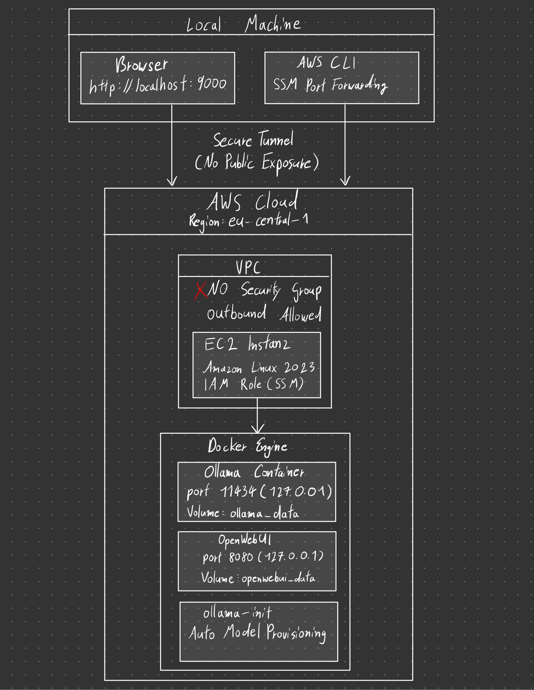

# Secure Multi-User LLM Infrastructure (Ollama + OpenWebUI) on AWS EC2 with SSM Port Forwarding

This project implements a secure, containerized multi-user LLM infrastructure running on AWS EC2.
The system is designed with an enterprise-level security focus, avoiding public exposure by using AWS Systems Manager (SSM) for controlled access instead of traditional SSH or open ports.

Ollama is deployed inside Docker alongside OpenWebUI, enabling scalable, isolated, and reproducible AI workloads.
The architecture follows cloud-native principles and can be extended toward GPU instances, private VPC setups, or production-ready AI platforms.

## Requirements

### Infrastructure

- AWS EC2 instance (recommended: 8 GB RAM or more)
- Minimum 30 GB storage
- Amazon Linux 2023 (or compatible Linux distribution)

### Software

- Docker
- Docker Compose
- AWS CLI

AWS Session Manager Plugin (for secure port forwarding)

### Recommended for Production Usage

- 16+ GB RAM for larger LLMs
- GPU-enabled instance for performance-intensive workloads
- IAM role with SSM permissions attached to the EC2 instance

## Setup & Run
### 1. Connect to EC2 via SSM 
> Connect to your EC2 instance using **AWS Systems Manager**  
> No SSH access and no open inbound ports are required.

### 2. Deploy Infrastructure (Executed on EC2)
Clone the repository and start the containers:
```bash 
git clone https://github.com/Srakawichi/multi-user-ai-infrastructure.git
cd multi-user-ai-infrastructure
./start.sh
```
This process starts all required containers, automatically provisions the LLM model, and initializes persistent storage.
### 3. Create Secure Port Forwarding Session (Executed on Local Machine)
From your local system (e.g. Windows with AWS CLI installed), establish the secure tunnel:
```bash
aws ssm start-session \
  --target <INSTANCE_ID> \
  --document-name AWS-StartPortForwardingSession \
  --parameters "portNumber=8080,localPortNumber=9000"
```
### 4. Access Web Interface
```bash
http://localhost:9000
```
### Note
- If running the system locally (Linux recommended), only step 2 is required.
- If port 8080 is already in use, adjust the port mapping in the docker-compose.yml file.

## Architecture



The architecture follows a zero-trust design, avoiding any public exposure. 
Access is exclusively managed through AWS Systems Manager (SSM) with IAM-based authentication.

## Features

- Secure access via AWS Systems Manager (no SSH, no public ports)
- Containerized LLM deployment using Docker Compose
- Multi-user web interface via OpenWebUI
- Automatic model provisioning at startup
- Persistent storage for models and application data
- Localhost-only container binding (127.0.0.1)
- IAM role-based authentication

## Used Technologies

- AWS EC2
- AWS Systems Manager (SSM)
- AWS IAM
- Amazon Linux 2023
- Docker
- Docker Compose
- Ollama
- OpenWebUI
- Bash
- AWS CLI


